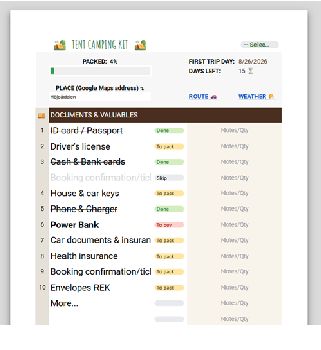

# Automated Camping Gear Tracker & Packing List (Google Sheets)

An automated, mobile-optimized packing checklist built in Google Sheets to streamline gear organization, track packing progress, and automatically generate required sub-lists.

## Key Features
- **Dynamic Progress Tracking:** Visual progress bars and status indicators to monitor packed gear in real-time.
- **Automated Sub-Lists:** Formulas filter the primary checklist into auto-generated Shopping Lists and Packed Summaries.
- **Conditional Formatting:** Color-coded item statuses (`To pack`, `Done`, `To buy`, `Skip`).
- **Mobile-Optimized UX:** Clean, structured layout designed for quick checkbox toggling on mobile devices.

## Technical Details & Logic
- **Formulas Used:** `FILTER`, `QUERY`, `ARRAYFORMULA`, `IF`, `COUNTIF`, `SPARKLINE`.
- **Data Validation:** Dropdown menus for item status tracking to ensure data consistency.
- **Edge-Case Handling:** Designed for varying environmental conditions and trip durations (dynamic day counter).

## How to Use
1. Access the template link below to make a copy.
2. Update your master gear list and customize categories.
3. Check off items as you pack; dynamic summaries will update automatically.

---
*Created as part of a software QA and Data Analysis portfolio.*
